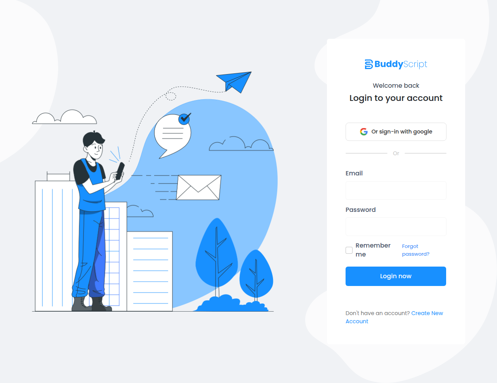
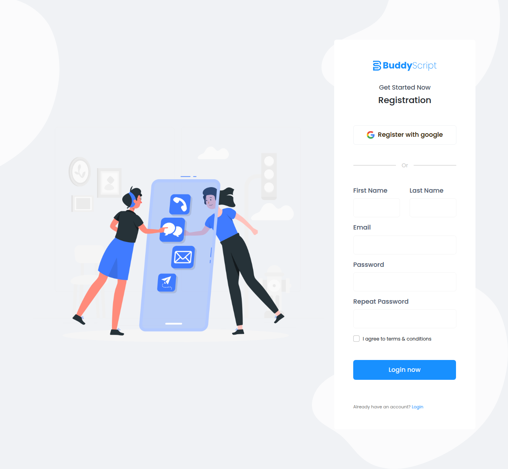
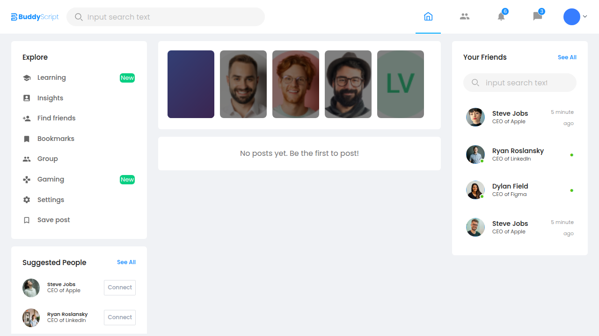

# BuddyScript — Social Media Platform

A full-stack social media web application built with a decoupled REST API backend and a modern React frontend, fully containerized with Docker.

---

## Table of Contents

- [Overview](#overview)
- [Tech Stack](#tech-stack)
- [Features](#features)
- [Project Screenshots](#project-screenshots)
- [Architecture Decisions](#architecture-decisions)
- [Project Structure](#project-structure)
- [How to Run the Project](#how-to-run-the-project)
- [Environment Variables](#environment-variables)
- [API Overview](#api-overview)

---

## Overview

BuddyScript is a social media platform where users can register, log in, create posts (with optional image attachments), like posts, comment on posts, reply to comments, and browse a public feed. The project follows an API-first design, keeping the backend and frontend fully decoupled.

---

## Tech Stack

### Backend
| Tool / Library | Version | Purpose |
|---|---|---|
| PHP | 8.3 | Runtime |
| Laravel | 13 | REST API framework |
| Laravel Sanctum | 4 | Token-based SPA authentication |
| MySQL | 8.0 | Relational database |
| Nginx | latest | Web server (inside container) |
| Supervisor | latest | Process manager (PHP-FPM + queue) |
| Laravel Pint | 1 | PHP code formatter |
| PHPUnit | 12 | Testing framework |
| Faker | 1.23 | Test data generation |

### Frontend
| Tool / Library | Version | Purpose |
|---|---|---|
| Next.js | 16.2.2 | React framework (App Router, SSR) |
| React | 19.2.4 | UI library |
| TypeScript | 5 | Type-safe JavaScript |
| Tailwind CSS | 4 | Utility-first CSS framework |
| Axios | 1.14 | HTTP client for API requests |
| Bootstrap | 5 | UI component styling |

### Infrastructure
| Tool | Purpose |
|---|---|
| Docker | Containerization |
| Docker Compose | Multi-service orchestration |
| Node 20 Alpine | Frontend container base image |
| PHP 8.3-FPM Alpine | Backend container base image |

---

## Features

- **Authentication** — Register, login, logout using token-based auth (Laravel Sanctum)
- **Posts** — Create posts with optional image upload, set visibility (public/private), delete own posts
- **Feed** — Paginated public feed showing all public posts, most recent first
- **Likes** — Like/unlike posts, comments, and replies; view who liked an item
- **Comments** — Add comments to posts, delete own comments
- **Replies** — Reply to comments with nested threading
- **Stories Row** — Horizontal stories section in the feed
- **Protected Routes** — Middleware-enforced authentication for feed access

---

## Project Screenshots

### Login Page


### Registration Page


### Feed Page


---

## Architecture Decisions

### API-First / Decoupled Architecture
The backend exposes a versioned REST API (`/api/v1/`) and the frontend is a completely separate Next.js application. This separation makes it straightforward to add mobile clients or other consumers in the future without changing the backend.

### Laravel Sanctum for Authentication
Sanctum provides lightweight SPA token authentication. Tokens are issued on login and sent with every subsequent request via the `Authorization: Bearer` header. This approach is stateless and works well across separate origins.

### Polymorphic Likes
A single `likes` table with `likeable_type` and `likeable_id` columns handles likes for posts, comments, and replies. This avoids three separate like tables and makes the toggle logic reusable in a single `LikeService`.

### Cursor-Based Pagination
The feed uses cursor-based pagination instead of offset-based (`page=N`). This prevents duplicate or missing posts when new content is added while scrolling, which is a common issue with offset pagination on real-time feeds.

### Service Layer
Business logic (post creation, like toggling, etc.) is extracted into service classes under `app/Services/Api/V1/`. Controllers stay thin — they validate input, call a service, and return a response. This makes the logic testable in isolation.

### Soft Deletes
Posts and comments use Laravel's soft deletes (`deleted_at` column). Deleted records are hidden from queries but remain in the database, enabling data recovery and preserving referential integrity for likes and replies.

### Docker Multi-Stage Builds
Both backend and frontend Dockerfiles use multi-stage builds. The frontend produces a minimal Next.js standalone output. The backend uses PHP-FPM + Nginx + Supervisor in a single Alpine container managed by a custom entrypoint script, keeping the deployment footprint small.

---

## Project Structure

```
social_media_site/
├── backend/                        # Laravel 13 REST API
│   ├── app/
│   │   ├── Http/
│   │   │   ├── Controllers/Api/V1/ # Auth, Post, Comment, Reply, Like controllers
│   │   │   └── Requests/Api/V1/    # Form request validation classes
│   │   ├── Models/                 # User, Post, Comment, Reply, Like
│   │   ├── Policies/               # PostPolicy (authorization)
│   │   └── Services/Api/V1/        # PostService, CommentService, LikeService
│   ├── database/
│   │   ├── migrations/             # All table migrations
│   │   ├── factories/              # Model factories for seeding
│   │   └── seeders/                # DatabaseSeeder, UserSeeder, PostSeeder
│   ├── routes/api.php              # All API routes (versioned under /api/v1/)
│   └── Dockerfile
│
├── frontend/                       # Next.js 16 Application
│   ├── src/
│   │   ├── app/
│   │   │   ├── (auth)/login/       # Login page
│   │   │   ├── (auth)/register/    # Registration page
│   │   │   └── feed/               # Main feed + all feed components
│   │   ├── lib/api.ts              # Axios API client wrapper
│   │   ├── types/index.ts          # TypeScript type definitions
│   │   └── components/             # Shared components (Avatar, etc.)
│   └── Dockerfile
│
├── screenshots/                    # Project screenshots
├── docker-compose.yml              # Orchestrates mysql, backend, frontend
└── README.md
```

---

## How to Run the Project

### Prerequisites

- [Docker](https://docs.docker.com/get-docker/) and [Docker Compose](https://docs.docker.com/compose/install/) installed on your machine.

---

### Option 1: Run with Docker (Recommended)

This is the easiest way to run the full stack with a single command.

**1. Clone the repository**
```bash
git clone <repository-url>
cd social_media_site
```

**2. Start all services**
```bash
docker compose up --build
```

This will:
- Start a MySQL 8.0 database on port `3306`
- Build and start the Laravel backend on port `8000`
- Build and start the Next.js frontend on port `3000`
- Run database migrations and seeders automatically on first start

**3. Open the app**

| Service | URL |
|---|---|
| Frontend | http://localhost:3000 |
| Backend API | http://localhost:8000/api/v1 |

**4. Stop the services**
```bash
docker compose down
```

To also remove database volumes (fresh start):
```bash
docker compose down -v
```

---

### Option 2: Run Locally (Without Docker)

#### Backend Setup

**Requirements:** PHP 8.3, Composer, MySQL 8.0

```bash
cd backend

# Install PHP dependencies
composer install

# Copy environment file and configure
cp .env.example .env

# Edit .env — set your DB_HOST, DB_DATABASE, DB_USERNAME, DB_PASSWORD
# Also set APP_URL=http://localhost:8000

# Generate app key
php artisan key:generate

# Run migrations and seed the database
php artisan migrate --seed

# Create storage symlink (for uploaded images)
php artisan storage:link

# Start the development server
php artisan serve --port=8000
```

#### Frontend Setup

**Requirements:** Node.js 20+

```bash
cd frontend

# Install dependencies
npm install

# Copy environment file
cp .env.local.example .env.local

# Edit .env.local:
# NEXT_PUBLIC_API_URL=http://localhost:8000/api/v1
# NEXT_PUBLIC_STORAGE_URL=http://localhost:8000/storage

# Start the development server
npm run dev
```

The frontend will be available at http://localhost:3000.

---

## Environment Variables

### Backend (`backend/.env`)

| Variable | Default | Description |
|---|---|---|
| `APP_NAME` | Laravel | Application name |
| `APP_ENV` | local | Environment (`local`, `production`) |
| `APP_URL` | http://localhost | Backend base URL |
| `DB_HOST` | 127.0.0.1 | MySQL host |
| `DB_PORT` | 3306 | MySQL port |
| `DB_DATABASE` | social_media | Database name |
| `DB_USERNAME` | laravel | Database user |
| `DB_PASSWORD` | secret | Database password |
| `FILESYSTEM_DISK` | local | Storage disk (`local` or `s3`) |
| `BCRYPT_ROUNDS` | 12 | Password hash cost factor |

### Frontend (`frontend/.env.local`)

| Variable | Example | Description |
|---|---|---|
| `NEXT_PUBLIC_API_URL` | http://localhost:8000/api/v1 | Backend API base URL |
| `NEXT_PUBLIC_STORAGE_URL` | http://localhost:8000/storage | Storage URL for uploaded images |

---

## API Overview

All API routes are versioned under `/api/v1/`.

| Method | Endpoint | Auth | Description |
|---|---|---|---|
| POST | `/api/v1/register` | No | Register a new user |
| POST | `/api/v1/login` | No | Login and receive token |
| POST | `/api/v1/logout` | Yes | Logout and invalidate token |
| GET | `/api/v1/user` | Yes | Get authenticated user info |
| GET | `/api/v1/posts` | Yes | List all public posts (paginated) |
| POST | `/api/v1/posts` | Yes | Create a new post |
| DELETE | `/api/v1/posts/{id}` | Yes | Delete own post |
| POST | `/api/v1/posts/{id}/comments` | Yes | Add a comment to a post |
| DELETE | `/api/v1/comments/{id}` | Yes | Delete own comment |
| POST | `/api/v1/comments/{id}/replies` | Yes | Reply to a comment |
| POST | `/api/v1/likes` | Yes | Toggle like on post/comment/reply |
| GET | `/api/v1/likes` | Yes | Get list of users who liked an item |
